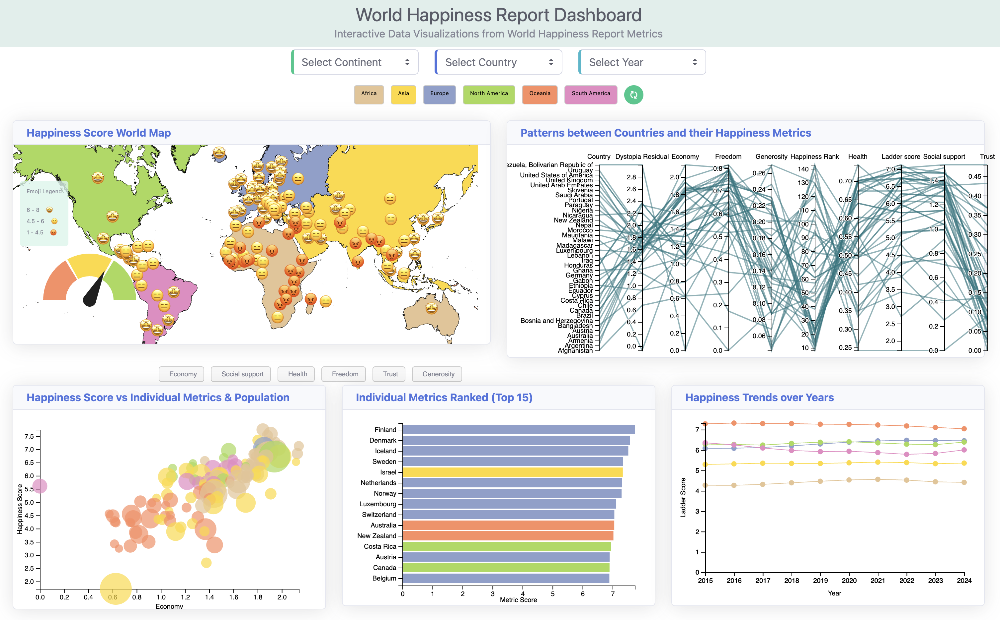
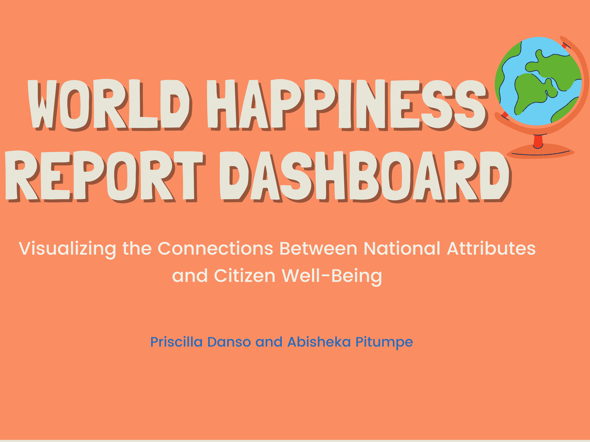

# World Happiness Dashboard

A web application for visualizing and exploring the World Happiness Report data using D3.js for data visualization and Python Flask for the backend.

## Features
- Interactive map for visualizing data geographically.
- Interactive Parallel Coordinate Plot (PCP) for comparing countries across multiple metrics.
- Bubble chart for visualizing the relationship between two metrics.
- Bar chart showing the top 15 countries for a selected metric.
- Multiline chart shows the trends of happiness scores over the years for different continents.

## Technologies Used
- D3.js
- Python Flask
- HTML
- CSS
- Bootstrap

## Demo
Check out the [demo video on YouTube](https://youtu.be/fR5rm0slXIo) to see the dashboard in action.

 

## Getting Started
1. Clone the repository.
2. Install the required dependencies.
3. Run the Flask server.
4. Open the dashboard in your browser.

## License
This project is licensed under the MIT License - see the [LICENSE](LICENSE) file for details.
